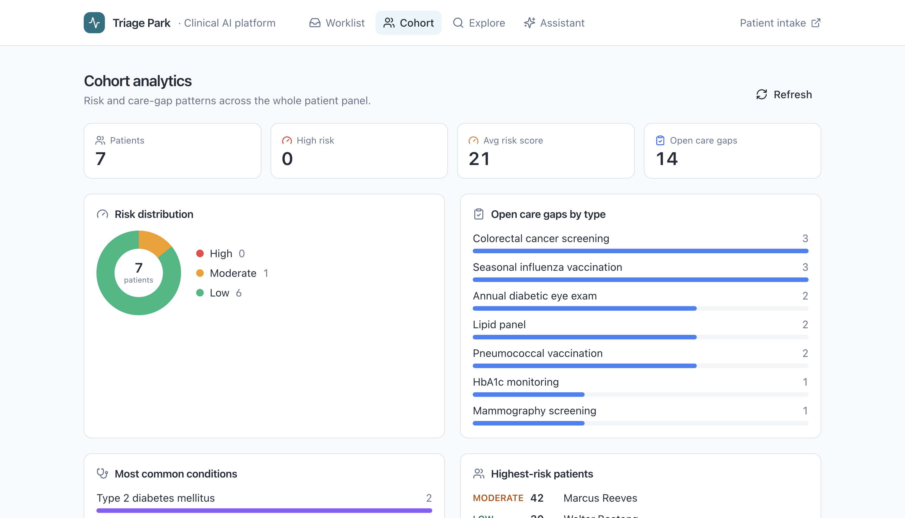
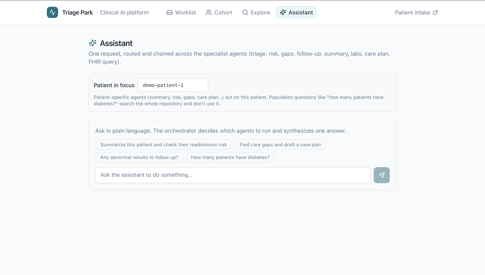
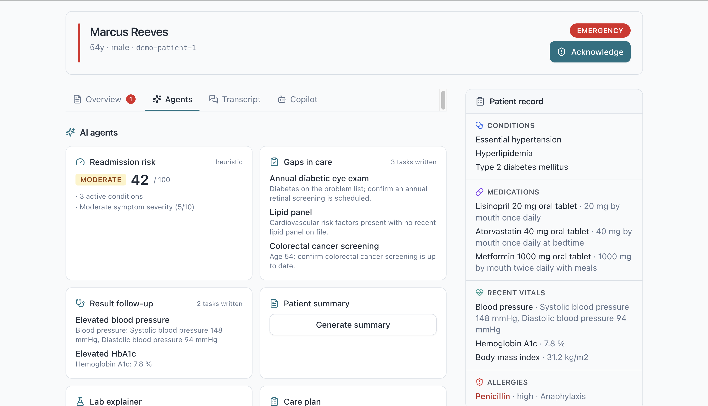
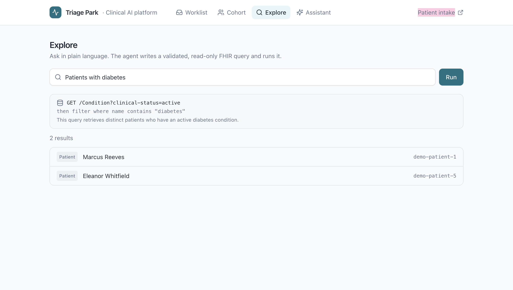
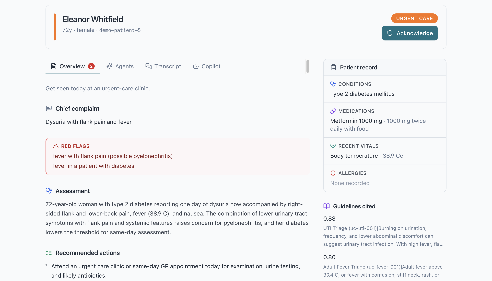

# Triage Park

**A multi-agent clinical triage platform on IRIS**

[](https://triagepark.78-47-167-98.sslip.io/) [](https://youtu.be/3hqf62btWYQ) [](https://youtu.be/Zf9vTcCACo0) [](LICENSE) · Built for the [InterSystems Programming Contest: AI Agents for FHIR](https://openexchange.intersystems.com/contest/46)

Every visit starts with the same manual work: take the patient's history, cross-check their record, judge how urgent it is. Triage Park does that first pass for you, as a coordinated team of specialist agents on InterSystems IRIS. A patient answers a short adaptive intake interview in their own language; a LangGraph triage agent reads their FHIR record and runs a tool-using reasoning loop over guidelines retrieved by vector search; a deterministic safety check screens for medication and allergy interactions; a reviewer grounds the citations and can escalate; and a clinician opens a ready-made handoff (a triage level: self-care, see-GP, urgent-care, or ED) with a cited rationale and the full reasoning trail. The clinician can then ask a read-only copilot about the case, run the agent toolbox, view cohort analytics, or query FHIR in natural language. Every interview and outcome is written back to FHIR as standard R4 resources.

It implements the contest's suggested **Conversational FHIR Triage Assistant**, and the agents are called inside a real IRIS Interoperability production. A REST business service dispatches to a triage business operation that raises `Ens.AlertRequest` on escalation, so every triage is a traceable message in Visual Trace rather than a side-channel API call.

---

## Contents

- [The agents](#the-agents) — the full roster of reasoning agents, deterministic checks, and FHIR skills
- [Why Triage Park](#why-triage-park) — what sets this entry apart: the depth under the breadth
- [See it](#see-it) — videos, the live demo, and screenshots
- [Quickstart](#quickstart) — one command to boot all three services
- [What it does](#what-it-does) — the two front doors (patient intake, clinician console)
- [How the triage agent works](#how-the-triage-agent-works) — the layered, one-directional safety design
- [Architecture](#architecture) — services, data flow, and the sidecar/ML notes
- [InterSystems features](#intersystems-features-used) — FHIR, Vector Search, AI Hub, Interoperability, IntegratedML
- [Contest bonuses](#contest-bonuses) — which bonuses this submission earns, and where
- [Demo data](#demo-data) — the seeded patients and cases
- [Verify](#verify) — curl commands to confirm each capability

---

## The agents

**A supervisor orchestrator coordinating genuine reasoning agents, deterministic safety checks, and a library of FHIR skills, all called inside one IRIS Interoperability production.** The split is deliberate: judgment-heavy work is agentic (tool-using loops that decide and act); safety-critical work is deterministic (rules, not an LLM).

| Agent | Type | What it does |
| --- | --- | --- |
| **Orchestrator** | Supervisor agent | Routes a plain-language request to the right component(s) and chains several in one request, then synthesizes one answer |
| **Triage reasoner** | Agent (tool loop) | Bounded ReAct loop: fetches more guidelines / observations / the risk score, then commits a triage |
| **Intake** | Agent (adaptive loop) | Runs the adaptive, multilingual interview, choosing each next question from prior answers + the FHIR record (3–7 questions, always terminates) |
| **Copilot** | Agent (tool loop) | Read-only, grounded Q&A about a case in the console |
| **Reviewer** | LLM critic | Self-critique: grounds citations against what was retrieved, may escalate, never downgrades |
| **Red-flag gate** | Deterministic check | Short-circuits can't-miss emergencies straight to ED before any LLM call |
| **Safety / interaction check** | Deterministic check | Screens medications + allergies against the complaint; writes `DetectedIssue`s; raises acuity only |
| **Gaps-in-care check** | Deterministic check | Flags overdue screenings, vaccinations, and chronic-disease monitoring from age + conditions + results; writes FHIR `Task`s |
| **Result follow-up check** | Deterministic check | Flags out-of-range recent results (BP, HbA1c, glucose, etc.) and writes FHIR `Task`s |
| **Cohort** | Deterministic (batch) | Population view: runs risk + gaps across every patient and aggregates them |
| **Risk** | ML model + heuristic | Readmission/deterioration risk with band, score, and drivers. Uses an in-IRIS AutoML model when enabled, a transparent heuristic otherwise, so it always works (see note under Architecture) |
| **Patient summary** | LLM skill | Role-aware (clinician or patient) clinical summary synthesized from the FHIR record |
| **Lab explainer** | LLM skill | Plain-language, patient-facing explanation of recent results |
| **Care plan** | LLM skill (writes FHIR) | Drafts a reviewable care plan from the record and writes a FHIR `CarePlan` |
| **NL→FHIR query** | LLM skill | Translates a plain-language question into a validated, read-only FHIR search and runs it |

A supervisor orchestrator sits over the specialist agents: it classifies a clinician's request and dispatches to the right one, and can chain several (for example "summarize, check risk, and flag care gaps" runs summary → risk → gaps and synthesizes the result). Each specialist keeps its own depth, so routing does not flatten the triage agent's tool loop, the deterministic safety floor, or the self-critique reviewer.

Triage is the flagship, but it is one capability among many: the same FHIR-grounded, deterministically-safe core powers risk stratification, preventive-care gap detection, result follow-up, care planning, summarization, lab explanation, population analytics, natural-language FHIR querying, and a clinician copilot, all inside one IRIS Interoperability production.

The three one-directional safety layers (the red-flag gate, the medication-interaction check, and the reviewer's deterministic citation-grounding) are the floor: each can only raise acuity, never lower it, so patient safety never rests on an LLM getting it right.

---

## Why Triage Park

Breadth alone isn't the point. What sets this entry apart is the depth underneath it:

- **A deterministic safety floor that can only escalate.** Three safety layers (red-flag gate, medication-interaction check, and the reviewer's citation-grounding) run as non-LLM or one-directional checks. Each can raise acuity, never lower it, so patient safety never depends on a model getting it right in one shot.
- **Real agentic reasoning, not a one-shot prompt.** The triage agent runs a bounded tool-using loop and a self-critique reviewer that drops hallucinated citations. Most entries call the model once; this one reasons, checks itself, and explains the result.
- **Platform-native, not bolted on.** Agents run inside a real Interoperability production (every triage is traceable in Visual Trace); embeddings and `VECTOR_COSINE` search run server-side via AI Hub; readmission risk is IntegratedML.
- **Full FHIR write-back and explainable.** Eight resource types are written back, and the console reconstructs an entire past case, including which agents ran, from FHIR alone, with no LLM re-run.
- **One command, then a live URL.** `docker compose up --build` boots all three services, or open the [hosted demo](https://triagepark.78-47-167-98.sslip.io/).

---

## See it

**▶ [Why Triage Park](https://youtu.be/3hqf62btWYQ):** the problem it solves and why the pre-checkup is worth automating. · **▶ [Walkthrough](https://youtu.be/Zf9vTcCACo0):** the patient interviews, the agent triages, the clinician reviews. · **[Try the live demo](https://triagepark.78-47-167-98.sslip.io/)** ([patient intake](https://triagepark.78-47-167-98.sslip.io/intake))

| Patient intake interview (`/intake`) | Clinician worklist (`/`) |
| --- | --- |
|  |  |
| Cohort analytics | Assistant (orchestrator) |
|  |  |
| Agent toolbox (per case) | Explore (natural-language FHIR) |
|  |  |

The clinician handoff is grounded on the patient's FHIR record, with cited guidelines, detected interactions, the multi-agent reasoning trail, and the IDs of every resource written back:


---

## Quickstart

```bash
git clone https://github.com/eungi-hong/central-park.git
cd central-park
cp .env.example .env          # then set OPENAI_API_KEY=sk-...
docker compose up --build      # IRIS cold start ~90s
```

Then open:

| URL | For |
| --- | --- |
| **http://localhost:8501** | Clinician console, the triage worklist |
| **http://localhost:8501/intake** | Patient self-intake, the interview |
| http://localhost:52773/csp/sys/UtilHome.csp | IRIS Management Portal (`_SYSTEM` / `SYS`) |

Once seeding finishes, the console shows six example cases spanning all four triage levels, with no interview needed. Then open `/intake`, run the demo patient `demo-patient-1` (Marcus Reeves, cardiac-risk-loaded) through the chest-tightness scenario, and watch a new case appear live in the worklist.

> Prefer not to install anything? The full app is hosted at **[triagepark.78-47-167-98.sslip.io](https://triagepark.78-47-167-98.sslip.io/)**.

---

## What it does

Two front doors share one FHIR backend.

- **Patient intake** (`/intake`) is a first-person, adaptive interview in the patient's chosen language (English, Spanish, Chinese, French, Arabic). It opens with the patient's main concern, then the agent chooses each following question from the answers so far plus the patient's FHIR record, stopping when it has enough to triage. Answers are saved to FHIR as a `QuestionnaireResponse`, and the patient gets a plain-language next step. If the agent is unreachable, intake falls back to a fixed question set so it never stalls.
- **Clinician console** (`/`) has four surfaces: a **Worklist** of triaged cases (with caseload KPIs), a **Cohort** analytics view (risk distribution, care gaps grouped by type, top conditions), an **Explore** view for natural-language FHIR queries, and an **Assistant** that routes a request across the specialist agents. Opening a case shows the patient's record, transcript, assessment and cited guidelines, detected interactions, the multi-agent reasoning trail, an **Acknowledge** action, the full **toolbox** (risk, gaps, follow-up, summary, labs, care plan), and a read-only **copilot** agent.

---

## How the triage agent works

The agent is more than a retrieve-then-prompt pipeline. A core design choice is that clinical safety is layered, and every layer is one-directional: each can only raise acuity, never lower it.

```
gather_context
      │
      ▼
check_safety         ── deterministic med/allergy screen ──▶ writes DetectedIssue(s), sets a triage floor
      │
      ▼
validate_red_flags   ── hard emergency phrase matched ──▶ escalate to ED  (no LLM call)
      │
      └── clear
            │
            ▼
        reason   (agentic tool-using loop: fetch more guidelines / observations / risk score, then commit)
            │
            ▼
        verify   (self-critique: ground citations, fold in the safety floor, may escalate, never downgrade)
            │
            └──▶ escalate if urgent-care/ED, else done
```



`validate_red_flags` runs before any LLM call. A non-negated match on a can't-miss phrase (with a cheap negation guard, so "no slurred speech" does not fire) short-circuits straight to ED escalation and skips the model entirely. It can only escalate, so a missed keyword can never lower a triage level below a matched red flag.

`check_safety` is the deterministic medication-interaction check. It runs before the LLM, cross-referencing active medications and allergies against the complaint, writes any findings as FHIR `DetectedIssue`s, and sets a triage floor that the rest of the graph can only raise to.

`reason` is a bounded ReAct-style loop. Each turn the model returns JSON choosing either a tool call (`search_guidelines` on a refined query, `get_observations` to zoom into specific vitals/labs, or `get_risk_score` to consult the IntegratedML model) or a final triage. The loop is capped and falls back to a single structured call if the model never commits, so it always resolves.

`verify` is a self-critique pass over the reasoner's answer. It deterministically drops any citation whose source was not actually retrieved (no hallucinated guidelines reach the clinician), then lets an LLM critic escalate the level when the evidence warrants. The critic is structurally forbidden from downgrading.

The red-flag scope is deliberately narrow: only presentations that warrant the ED regardless of context. Nuanced complaints such as chest tightness are intentionally not hard-coded, because they need the patient's FHIR risk factors and guideline retrieval to triage correctly, and that reasoning is the loop's job. The gate is the floor under the reasoner, not a replacement for it. These paths are covered by unit tests (`src/python/tests/`): the deterministic gate, the escalate-only verifier, and the loop's tool execution and fallback.

### The adaptive interview

Intake is agentic too. Rather than a fixed form, the agent picks each next question from the answers so far plus the patient's FHIR record, **in the patient's chosen language**, and stops once it can triage confidently. The flow is bounded so it always terminates: it asks **between 3 and 7 questions**, may not stop before the minimum, and is hard-capped at the maximum. A cardiac-risk-loaded patient reporting chest symptoms gets asked about exertion and radiation; a simple sore throat stops early. Each step is one POST to `/api/interview/next`; if the agent is unreachable the UI falls back to a fixed question set so intake never stalls.

---

## Architecture

```
            browser
   ┌───────────┴────────────┐
   /intake (patient)   /  (clinician)
   └───────────┬────────────┘
        central-park-ui  (React SPA + nginx :8501)
        ├─ /fhir/* → IRIS FHIR R4   (Basic auth injected server-side)
        └─ /api/*  → agent
                       │
   ┌───────────────────┼─────────────────────────────────┐
   │ central-park-iris (IRIS for Health)                 │
   │   FHIR R4 endpoint  ·  REST dispatch (/triage …)    │
   │   Interoperability production:                       │
   │     REST inbox (BS) → triage agent (BO) →            │
   │     Ens.AlertRequest on escalation                   │
   │   %Embedding.OpenAI (AI Hub)  ·  VECTOR_COSINE       │
   │   IntegratedML (AutoML) risk model  ·  /risk/predict │
   └───────────────────┼─────────────────────────────────┘
                        │ POST /run · /interview · /interview/next · /copilot
                        │      · /summary · /labs · /gaps · /risk · /careplan
                        │      · /followup · /query · /orchestrate  ·  GET /cohort
        central-park-agent (FastAPI + LangGraph)
          gather_context → check_safety → retrieve_guidelines →
          validate_red_flags → reason (tool loop) → verify → escalate
          (copilot: read-only grounded Q&A)
                        │
                  OpenAI (chat)
```

Three services and one external dependency (OpenAI). The agent is invoked through the IRIS production: `CentralPark.REST.Dispatch` spawns the `RESTInbox` business service, which `SendRequestSync`s to the `TriageAgent` business operation, so every call lands in Visual Trace as an `Ens.MessageHeader`. The LangGraph reasoning itself executes in the Python sidecar over HTTP; see the note below on why.


> **Why a sidecar and not Embedded Python?** The production graph stays first-class either way, because the agent is a real business operation in Visual Trace. But this image's ARM64 Embedded Python build is unstable (Callin `<SYSTEM>` aborts on `import`, broken `_uuid`), so running the LangGraph stack in-process would make the app fail to start on Apple-Silicon hosts. Keeping the reasoner in a sidecar trades the Embedded Python bonus for an app that boots reliably everywhere, which matters for a demo a judge has to run.

> **On the risk workbench.** The risk model is real IntegratedML: `CentralPark.ML` creates and trains an AutoML model (`CREATE MODEL` / `TRAIN MODEL`) on a synthetic cohort and serves row-level `PREDICT` over `/risk/predict`. AutoML trains via the same Embedded Python runtime, so on the ARM64 demo image it is **disabled by default** (`CP_ENABLE_ML=0`); set `CP_ENABLE_ML=1` on an x86 host to train and serve it. So the workbench is useful everywhere, the risk agent **falls back to a transparent heuristic** (age + comorbidity + severity) when AutoML is off, and labels which method produced each score. The triage agent likewise treats the model as an optional `get_risk_score` tool and degrades gracefully.

---

## InterSystems features used

| Capability | How Triage Park uses it |
| --- | --- |
| **FHIR R4** | Reads patient context; writes 8 resource types (`QuestionnaireResponse`, `Encounter`, `ServiceRequest`, coded `Observation`s, `DetectedIssue`, `Task`, `CarePlan`, `Communication`); the NL→FHIR agent runs read-only searches |
| **Vector Search** | `VECTOR(float, 1536)` guideline corpus queried with HNSW-indexed `VECTOR_COSINE` |
| **AI Hub** | `%Embedding.Config` + `%Embedding.OpenAI` embed guidelines and queries inside IRIS; SSL config installed at boot |
| **Interoperability** | Production with a REST inbox business service, a triage agent business operation, and `Ens.AlertRequest` on urgent cases, with every triage visible in Visual Trace |
| **LLM / LangGraph** | A multi-agent platform under a supervisor orchestrator: the triage state machine (context → safety screen → red-flag gate → tool-using reason loop → reviewer → escalate), adaptive intake, clinician copilot, patient summary, lab explainer, gaps-in-care, result follow-up, care planning, risk workbench, cohort analytics, and NL→FHIR query |
| **IntegratedML** | `CREATE MODEL` / `TRAIN MODEL` AutoML risk model served via `PREDICT` at `/risk/predict`, consulted by the triage agent as a tool (gated by `CP_ENABLE_ML`; see Architecture note) |
| **Docker** | `docker compose up --build` boots all three services |
| **IPM / ZPM** | `module.xml` manifest for one-line deployment |

### FHIR resources written

| Resource | When | Carries |
| --- | --- | --- |
| `QuestionnaireResponse` | every interview | the patient's answers |
| `Encounter` | every triage | the virtual consultation |
| `ServiceRequest` | every triage | triage level (SNOMED), chief complaint, the agent's narrative (HPI, actions, red flags, cited guidelines), and clinician acknowledgement as notes |
| `Observation` | interview | LOINC severity score + SNOMED symptom flags parsed from answers |
| `DetectedIssue` | interaction found | a medication/allergy interaction flagged by the safety agent, with severity |
| `Task` | care gap / abnormal result | an overdue screening, vaccination, or result follow-up item (gaps-in-care + follow-up agents) |
| `CarePlan` | care plan drafted | the care-plan agent's reviewable plan with activities |
| `Communication` | urgent/ED | the escalation alert |

Persisting the narrative on the `ServiceRequest` is what lets the console reconstruct a full past case from FHIR alone, with no LLM re-run.

---

## Contest bonuses

The [contest bonuses](https://community.intersystems.com/post/technology-bonuses-intersystems-programming-contest-ai-agents-fhir) this submission earns, with where each lands.

| Bonus | Points | Where |
| --- | --- | --- |
| Implement a suggested task | 5 | **Conversational FHIR Triage Assistant**, suggested topic #10 |
| InterSystems FHIR Server usage | 2 | Native IRIS for Health FHIR R4 endpoint; reads context, writes 8 resource types, read-only NL→FHIR search |
| Vector Search usage | 4 | `VECTOR(float, 1536)` corpus queried with `VECTOR_COSINE` |
| LLM AI / LangChain usage | 3 | Multi-agent LangGraph platform: a supervisor orchestrator over reasoning agents (tool-using triage loop, self-critique reviewer, adaptive multilingual intake, copilot), plus deterministic checks and FHIR skills |
| Docker container usage | 2 | `docker compose up --build` boots all three services |
| ZPM (IPM) package deployment | 2 | `module.xml` manifest |
| Online Demo | 2 | [triagepark.78-47-167-98.sslip.io](https://triagepark.78-47-167-98.sslip.io/) |
| Implement a Community Idea | 4 | Implements [TTTC, *The Tool That Cares*](https://ideas.intersystems.com/ideas/DPI-I-283) |
| First Article on Developer Community | 2 | Build write-up on the Developer Community |
| Second Article on DC | 1 | Second write-up / translation |
| First Time Contribution | 3 | First InterSystems Open Exchange submission |
| Videos on YouTube (2 × 3) | 6 | [Why Triage Park](https://youtu.be/3hqf62btWYQ) · [Walkthrough](https://youtu.be/Zf9vTcCACo0) |

**Total: 36 points.**

---

## Project layout

```
.
├─ ui/                      # React SPA, clinician console (/) + patient intake (/intake)
├─ agent/                   # Dockerfile for the FastAPI + LangGraph sidecar
├─ src/
│  ├─ python/central_park/  # Agents: orchestrator, triage graph, reasoning loop, interview, copilot, summary, labs, gaps, followup, careplan, cohort, query; tools (FHIR · vector · safety · risk · escalate)
│  ├─ python/tests/         # Unit tests: red-flag gate, safety agent, reasoning loop, reviewer, interview, risk
│  └─ cls/CentralPark/      # ObjectScript: FHIR install, REST dispatch, interop production, IntegratedML (ML.cls)
├─ iris-config/             # Boot script + demo seed bundles (patients, questionnaire)
├─ web/                     # Static assets served by IRIS
├─ Dockerfile               # IRIS for Health image: namespace, FHIR R4 endpoint, classes
├─ docker-compose.yml       # iris + agent + ui  (+ optional ollama profile)
├─ docker-compose.prod.yml  # adds a Caddy HTTPS reverse proxy for the hosted demo
└─ module.xml               # OpenExchange / IPM manifest
```

> Internal identifiers keep the original `central-park` / `CentralPark` / `/centralpark` names (package, classes, REST path, containers); "Triage Park" is the product/display name.

---

## Demo data

Seeded automatically at agent startup: the agent waits for the FHIR endpoint, then loads the bundles in `iris-config/seed/` (and the guideline corpus). Every seed is idempotent, so it re-runs safely on each restart and a single `docker compose up` needs no manual seed step.

| Patient | Profile | Seeded case |
| --- | --- | --- |
| **Marcus Reeves** (`demo-patient-1`) | 53, HTN / hyperlipidemia / T2DM, cardiac-risk-loaded | (run the chest-tightness interview) |
| **Priya Nair** | 34, no chronic conditions | Self-care, sore throat |
| **Walter Boateng** | 70, COPD | See-GP, productive cough |
| **Liam Foster** | 5, parent-reported, prior ear infections | See-GP, fever and ear pain (otitis media) |
| **Eleanor Whitfield** | 72, type 2 diabetes | Urgent-care, dysuria with flank pain and fever (pyelonephritis) |
| **Daniel Osei** | 28, no chronic conditions | Urgent-care, migratory right-lower-quadrant pain (possible appendicitis) |
| **Sofia Marchetti** | 44, asthma | Emergency, acute breathlessness |

The seeded cases span all four triage levels across a range of ages and presentations. Marcus is deliberately cardiac-risk-loaded so a chest-tightness scenario exercises real reasoning over his FHIR record.

---

## Verify

```bash
curl http://localhost:8001/health                                    # agent
curl -u _SYSTEM:SYS http://localhost:52773/centralpark/health         # IRIS

# Vector search (no LLM chat cost; embeds + searches inside IRIS)
curl -X POST http://localhost:52773/centralpark/vector/search -u _SYSTEM:SYS \
  -H 'Content-Type: application/json' -d '{"query":"chest tightness on exertion","k":3}'

# Direct triage (chat LLM); runs the tool loop + verifier, writes a Communication when urgent
curl -X POST http://localhost:52773/centralpark/triage -u _SYSTEM:SYS \
  -H 'Content-Type: application/json' \
  -d '{"patient_id":"demo-patient-1","message":"My chest feels tight when I walk upstairs."}'

# Adaptive interview: ask the agent for the next question given the answers so far
curl -X POST http://localhost:8001/interview/next \
  -H 'Content-Type: application/json' \
  -d '{"patient_id":"demo-patient-1","answers":[{"link_id":"chief-complaint","question":"What is bothering you?","answer":"Chest tightness on the stairs"}]}'

# Safety agent: ACE-inhibitor patient + swelling escalates and writes a DetectedIssue
curl -X POST http://localhost:8001/run -H 'Content-Type: application/json' \
  -d '{"patient_id":"demo-patient-1","message":"my lips and tongue are swelling"}'

# Clinician copilot: read-only grounded Q&A about a patient
curl -X POST http://localhost:8001/copilot -H 'Content-Type: application/json' \
  -d '{"patient_id":"demo-patient-1","question":"What raises this patient'\''s cardiac risk?"}'

# More agents: risk, gaps (FHIR Tasks), summary, lab explainer, follow-up, care plan (CarePlan)
curl -X POST http://localhost:8001/risk     -H 'Content-Type: application/json' -d '{"patient_id":"demo-patient-1"}'
curl -X POST http://localhost:8001/gaps     -H 'Content-Type: application/json' -d '{"patient_id":"demo-patient-1"}'
curl -X POST http://localhost:8001/summary  -H 'Content-Type: application/json' -d '{"patient_id":"demo-patient-1"}'
curl -X POST http://localhost:8001/labs     -H 'Content-Type: application/json' -d '{"patient_id":"demo-patient-1"}'
curl -X POST http://localhost:8001/followup -H 'Content-Type: application/json' -d '{"patient_id":"demo-patient-1"}'
curl -X POST http://localhost:8001/careplan -H 'Content-Type: application/json' -d '{"patient_id":"demo-patient-1"}'

# Population analytics + natural-language FHIR query
curl http://localhost:8001/cohort
curl -X POST http://localhost:8001/query -H 'Content-Type: application/json' -d '{"question":"patients with diabetes"}'

# Orchestrator: one request routed + chained across specialist agents
curl -X POST http://localhost:8001/orchestrate -H 'Content-Type: application/json' \
  -d '{"patient_id":"demo-patient-1","message":"Summarize this patient, check readmission risk, and flag care gaps."}'

# Run the unit tests: red-flag gate, safety agent, reasoning loop, reviewer, interview, risk fallback
docker compose exec agent python -m pytest tests/ -q
```

Visual Trace shows every triage as an `Ens.MessageHeader`; the Embedding config lives under System Administration → Configuration → Connectivity → Embedding Configurations.

---

## Configuration

Defaults are baked into `docker-compose.yml`; `.env` overrides them.

| Variable | Default | Purpose |
| --- | --- | --- |
| `OPENAI_API_KEY` | *(required)* | Embeddings (IRIS) and chat (sidecar) |
| `CP_LLM_PROVIDER` | `openai` | `openai`, `anthropic`, or `ollama` for chat |
| `CP_OPENAI_MODEL` | `gpt-4o-mini` | Sidecar chat model |
| `CP_ENABLE_ML` | `0` | Train + serve the IntegratedML risk model. Leave `0` on ARM64; set `1` on x86 (AutoML needs Embedded Python) |

Switch chat to Anthropic (`CP_LLM_PROVIDER=anthropic` + `ANTHROPIC_API_KEY`) or offline Ollama (`docker compose --profile ollama up --build`); OpenAI is still required for embeddings. Run `docker compose restart agent` after changing `.env`.

---

## Notes

- **Iterate:** Python under `src/python/` is bind-mounted, so use `docker compose restart agent`. ObjectScript and boot config need `docker compose up --build`.
- **Seeding** runs automatically at agent startup and is idempotent. If the worklist ever looks empty (for example, if IRIS was unusually slow to start), `docker compose restart agent` re-runs the seed safely.
- **Data** persists in the `iris-data` volume across restarts. `docker compose down -v` wipes it and re-seeds on next boot.

---

## Authors

**Hong Eungi** and **Antor Chowdhury**, first-time InterSystems Open Exchange contributors.

**License:** MIT, see [LICENSE](LICENSE).
