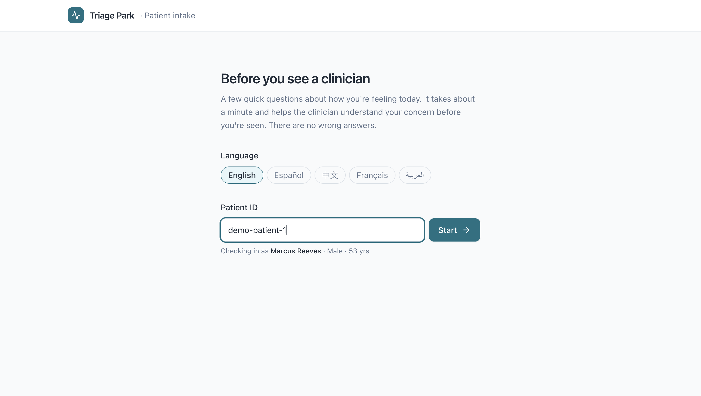
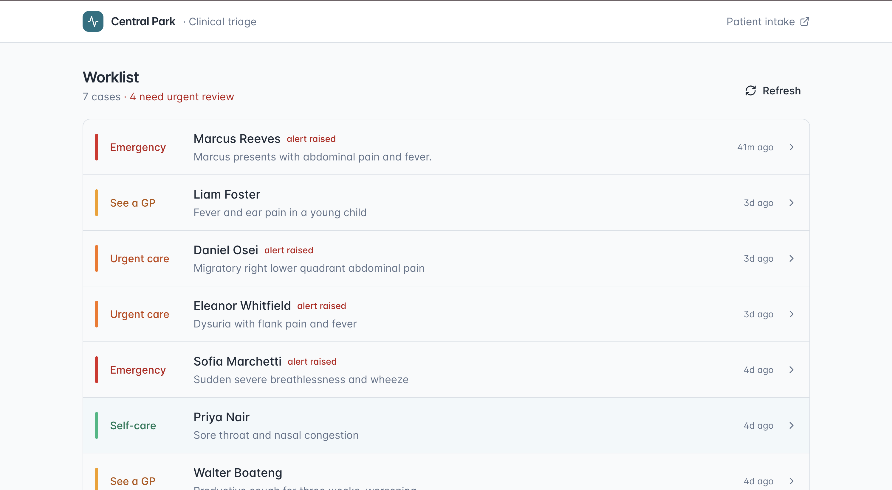
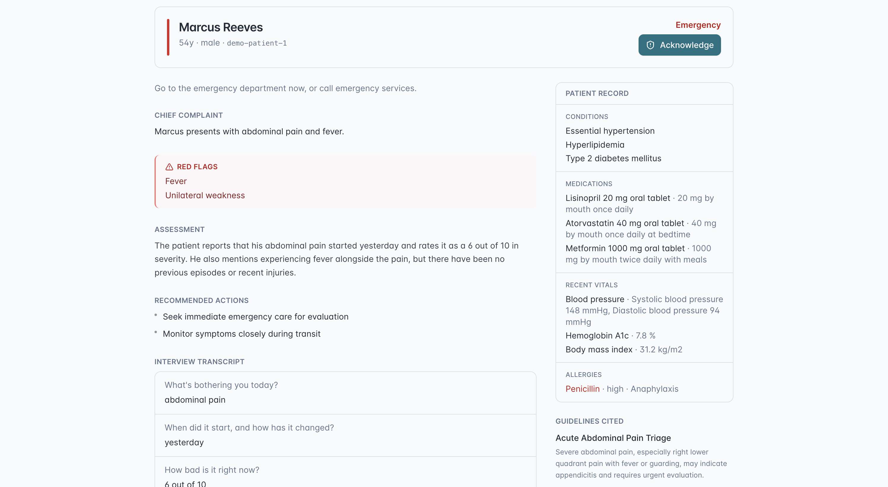

# Triage Park

**A multi-agent clinical triage platform on IRIS, with a deterministic safety floor that can only ever escalate.**

[](https://triagepark.78-47-167-98.sslip.io/) [](https://youtu.be/3hqf62btWYQ) [](https://youtu.be/GeOe1DwS50I) [](LICENSE) · Built for the [InterSystems Programming Contest: AI Agents for FHIR](https://openexchange.intersystems.com/contest/46)

Every visit starts with the same manual work: take the patient's history, cross-check their record, judge how urgent it is. Triage Park does that first pass for you, as a coordinated team of specialist agents on InterSystems IRIS. A patient answers a short adaptive intake interview; a LangGraph triage agent reads their FHIR record and runs a tool-using reasoning loop over guidelines retrieved by vector search; a deterministic safety agent screens for medication and allergy interactions; a reviewer agent grounds the citations and can escalate; and a clinician opens a ready-made handoff (a triage level: self-care, see-GP, urgent-care, or ED) with a cited rationale and the full reasoning trail. The clinician can then ask a read-only copilot anything about the case. Every interview and outcome is written back to FHIR as standard R4 resources.

It implements the contest's suggested **Conversational FHIR Triage Assistant**, and the agents are called inside a real IRIS Interoperability production. A REST business service dispatches to a triage business operation that raises `Ens.AlertRequest` on escalation, so every triage is a traceable message in Visual Trace rather than a side-channel API call.

---

## Why Triage Park

Triage is one of the most contested ideas in this contest. A few things set this entry apart:

- **Three layered safety mechanisms, every one of them one-directional.** They can only raise acuity, never lower it. A deterministic red-flag gate runs before any LLM call and short-circuits can't-miss emergencies (stroke signs, airway compromise, anaphylaxis, major haemorrhage, syncope, suicidal ideation) straight to ED. Above it, an agentic reasoning loop commits a triage. Above that, a self-critique verifier grounds the citations and may escalate but is forbidden from downgrading. Patient safety does not depend on an LLM getting it right in one shot.
- **A real agent, not a one-shot pipeline.** The reasoner runs a bounded tool-using loop: it decides what extra evidence it needs (a refined guideline search, a specific vital or lab) and gathers it before committing. The loop is capped and falls back to a single structured call, so it always resolves.
- **An adaptive intake interview.** Instead of a fixed form, the agent picks each next question from what it has already heard plus the patient's FHIR risk factors, and stops once it can triage confidently. A cardiac-risk-loaded patient reporting chest symptoms gets asked about exertion and radiation; a sore throat does not.
- **A deterministic medication-interaction agent.** Before reasoning, a non-LLM safety agent cross-references the patient's active medications and allergies against the complaint (anticoagulant + bleeding, ACE-inhibitor + angioedema, NSAID + GI bleed, allergy exposure) and writes findings as FHIR `DetectedIssue` resources. Findings can only raise the triage level.
- **A read-only clinician copilot.** From any case, a clinician can ask the agent free-text questions ("why ED?", "any interactions with their warfarin?") and get answers grounded on the FHIR record and cited guidelines. It cannot change a triage or write to the record, so it is safe to put in front of clinicians.
- **Explainable by construction.** Every case persists the reasoning trail (which agents ran, what tools the triage agent called, the reviewer's verdict), reconstructed in the console from FHIR alone. Nothing is a black box.
- **The agent lives in the platform.** It is an Interoperability business operation. Every triage flows through `Ens.MessageHeader` and is visible in Visual Trace, which is exactly the "AI agent called in an interoperability FHIR solution" the contest asks for.
- **Embeddings run server-side in IRIS.** The agent sends raw text, and IRIS computes embeddings via `%Embedding.OpenAI` (AI Hub) and runs HNSW-indexed `VECTOR_COSINE` search. This follows the platform's intended AI-Hub pattern.
- **Full FHIR write-back, not only reads.** Every interview persists five resource types (`QuestionnaireResponse`, `Encounter`, `ServiceRequest`, coded `Observation`s, `Communication`). The clinician console reconstructs an entire past case from FHIR alone, with no LLM re-run.
- **One command, then a live URL.** `docker compose up --build` boots all three services, or you can skip the clone entirely and open the [hosted demo](https://triagepark.78-47-167-98.sslip.io/).

---

## The agents

Triage Park is a team of specialist agents, coordinated by a LangGraph state machine and called inside the IRIS Interoperability production. Each does one job well, and the safety-critical ones are deterministic.

| Agent | Type | What it does |
| --- | --- | --- |
| **Intake agent** | LLM | Runs the adaptive interview, choosing each next question from prior answers + the FHIR record (3–7 questions, always terminates) |
| **Safety / interaction agent** | Deterministic | Screens medications + allergies against the complaint; writes `DetectedIssue`s; raises acuity only |
| **Red-flag gate** | Deterministic | Short-circuits can't-miss emergencies straight to ED before any LLM call |
| **Triage reasoning agent** | LLM (tool loop) | Bounded ReAct loop: fetches more guidelines / observations / the risk score, then commits a triage |
| **Reviewer agent** | LLM | Self-critique: grounds citations against what was retrieved, may escalate, never downgrades |
| **Risk agent** | IntegratedML | Reads an in-IRIS AutoML model for readmission/deterioration risk (see note under Architecture) |
| **Clinician copilot** | LLM (tool loop) | Read-only, grounded Q&A about a case in the console |

The three deterministic agents (red-flag gate, safety agent, reviewer's grounding step) are the floor: every one is one-directional and can only raise acuity, so patient safety never rests on an LLM getting it right.

---

## See it

**▶ [Why Triage Park](https://youtu.be/3hqf62btWYQ):** the problem it solves and why the pre-checkup is worth automating. · **▶ [Walkthrough](https://youtu.be/GeOe1DwS50I):** the patient interviews, the agent triages, the clinician reviews. · **[Try the live demo](https://triagepark.78-47-167-98.sslip.io/)** ([patient intake](https://triagepark.78-47-167-98.sslip.io/intake))

| Patient intake interview (`/intake`) | Clinician console (`/`) |
| --- | --- |
|  |  |

The clinician handoff is grounded on the patient's FHIR record, with cited guidelines and the IDs of every resource written back:



---

## Quickstart

```bash
git clone https://github.com/eungi-hong/central-park.git
cd central-park
cp .env.example .env          # then set OPENAI_API_KEY=sk-...
docker compose up --build      # IRIS cold start ~90s
```

Then open:

| URL | For |
| --- | --- |
| **http://localhost:8501** | Clinician console, the triage worklist |
| **http://localhost:8501/intake** | Patient self-intake, the interview |
| http://localhost:52773/csp/sys/UtilHome.csp | IRIS Management Portal (`_SYSTEM` / `SYS`) |

Once seeding finishes, the console shows six example cases spanning all four triage levels, with no interview needed. Then open `/intake`, run the demo patient `demo-patient-1` (Marcus Reeves, cardiac-risk-loaded) through the chest-tightness scenario, and watch a new case appear live in the worklist.

> Prefer not to install anything? The full app is hosted at **[triagepark.78-47-167-98.sslip.io](https://triagepark.78-47-167-98.sslip.io/)**.

---

## What it does

Two front doors share one FHIR backend.

- **Patient intake** (`/intake`) is a first-person, adaptive interview. It opens with the patient's main concern, then the agent chooses each following question from the answers so far plus the patient's FHIR record, stopping when it has enough to triage. Answers are saved to FHIR as a `QuestionnaireResponse`, and the patient gets a plain-language next step. If the agent is unreachable, intake falls back to a fixed question set so it never stalls.
- **Clinician console** (`/`) is a worklist of triaged cases, newest first, with urgent cases flagged. Opening a case shows the patient's standing record, the interview transcript, the agent's assessment and cited guidelines, any detected medication interactions, the multi-agent reasoning trail, an **Acknowledge** action for escalated cases (written back to FHIR), and a read-only **copilot** for asking grounded questions about the case.

---

## How the triage agent works

The agent is more than a retrieve-then-prompt pipeline. A core design choice is that clinical safety is layered, and every layer is one-directional: each can only raise acuity, never lower it.

```
gather_context
      │
      ▼
check_safety         ── deterministic med/allergy screen ──▶ writes DetectedIssue(s), sets a triage floor
      │
      ▼
validate_red_flags   ── hard emergency phrase matched ──▶ escalate to ED  (no LLM call)
      │
      └── clear
            │
            ▼
        reason   (agentic tool-using loop: fetch more guidelines / observations / risk score, then commit)
            │
            ▼
        verify   (self-critique: ground citations, fold in the safety floor, may escalate, never downgrade)
            │
            └──▶ escalate if urgent-care/ED, else done
```

`validate_red_flags` runs before any LLM call. A non-negated match on a can't-miss phrase (with a cheap negation guard, so "no slurred speech" does not fire) short-circuits straight to ED escalation and skips the model entirely. It can only escalate, so a missed keyword can never lower a triage level below a matched red flag.

`check_safety` is the deterministic medication-interaction agent. It runs before the LLM, cross-referencing active medications and allergies against the complaint, writes any findings as FHIR `DetectedIssue`s, and sets a triage floor that the rest of the graph can only raise to.

`reason` is a bounded ReAct-style loop. Each turn the model returns JSON choosing either a tool call (`search_guidelines` on a refined query, `get_observations` to zoom into specific vitals/labs, or `get_risk_score` to consult the IntegratedML model) or a final triage. The loop is capped and falls back to a single structured call if the model never commits, so it always resolves.

`verify` is a self-critique pass over the reasoner's answer. It deterministically drops any citation whose source was not actually retrieved (no hallucinated guidelines reach the clinician), then lets an LLM critic escalate the level when the evidence warrants. The critic is structurally forbidden from downgrading.

The red-flag scope is deliberately narrow: only presentations that warrant the ED regardless of context. Nuanced complaints such as chest tightness are intentionally not hard-coded, because they need the patient's FHIR risk factors and guideline retrieval to triage correctly, and that reasoning is the loop's job. The gate is the floor under the reasoner, not a replacement for it. These paths are covered by unit tests (`src/python/tests/`): the deterministic gate, the escalate-only verifier, and the loop's tool execution and fallback.

### The adaptive interview

Intake is agentic too. Rather than a fixed form, the agent picks each next question from the answers so far plus the patient's FHIR record, and stops once it can triage confidently. The flow is bounded so it always terminates: it asks **between 3 and 7 questions**, may not stop before the minimum, and is hard-capped at the maximum. A cardiac-risk-loaded patient reporting chest symptoms gets asked about exertion and radiation; a simple sore throat stops early. Each step is one POST to `/api/interview/next`; if the agent is unreachable the UI falls back to a fixed question set so intake never stalls.

---

## Architecture

```
            browser
   ┌───────────┴────────────┐
   /intake (patient)   /  (clinician)
   └───────────┬────────────┘
        central-park-ui  (React SPA + nginx :8501)
        ├─ /fhir/* → IRIS FHIR R4   (Basic auth injected server-side)
        └─ /api/*  → agent
                       │
   ┌───────────────────┼─────────────────────────────────┐
   │ central-park-iris (IRIS for Health)                 │
   │   FHIR R4 endpoint  ·  REST dispatch (/triage …)    │
   │   Interoperability production:                       │
   │     REST inbox (BS) → triage agent (BO) →            │
   │     Ens.AlertRequest on escalation                   │
   │   %Embedding.OpenAI (AI Hub)  ·  VECTOR_COSINE       │
   │   IntegratedML (AutoML) risk model  ·  /risk/predict │
   └───────────────────┼─────────────────────────────────┘
                        │ POST /run · /interview · /interview/next · /copilot
        central-park-agent (FastAPI + LangGraph)
          gather_context → check_safety → retrieve_guidelines →
          validate_red_flags → reason (tool loop) → verify → escalate
          (copilot: read-only grounded Q&A)
                        │
                  OpenAI (chat)
```

Three services and one external dependency (OpenAI). The agent is invoked through the IRIS production: `CentralPark.REST.Dispatch` spawns the `RESTInbox` business service, which `SendRequestSync`s to the `TriageAgent` business operation, so every call lands in Visual Trace as an `Ens.MessageHeader`. The LangGraph reasoning itself executes in the Python sidecar over HTTP; see the note below on why.

> **Why a sidecar and not Embedded Python?** The production graph stays first-class either way, because the agent is a real business operation in Visual Trace. But this image's ARM64 Embedded Python build is unstable (Callin `<SYSTEM>` aborts on `import`, broken `_uuid`), so running the LangGraph stack in-process would make the app fail to start on Apple-Silicon hosts. Keeping the reasoner in a sidecar trades the Embedded Python bonus for an app that boots reliably everywhere, which matters for a demo a judge has to run.

> **On the IntegratedML risk agent.** The risk model is real IntegratedML: `CentralPark.ML` creates and trains an AutoML model (`CREATE MODEL` / `TRAIN MODEL`) on a synthetic cohort and serves row-level `PREDICT` over `/risk/predict`. AutoML trains via the same Embedded Python runtime, so on the ARM64 demo image it is **disabled by default** (`CP_ENABLE_ML=0`) to keep boot fast and reliable; the triage agent treats `get_risk_score` as an optional tool and degrades gracefully when it is off. Set `CP_ENABLE_ML=1` on an x86 host to train and serve it.

---

## InterSystems features used

| Capability | How Triage Park uses it |
| --- | --- |
| **FHIR R4** | Reads patient context; writes `QuestionnaireResponse`, `Encounter`, `ServiceRequest`, coded `Observation`s, and `Communication` |
| **Vector Search** | `VECTOR(float, 1536)` guideline corpus queried with HNSW-indexed `VECTOR_COSINE` |
| **AI Hub** | `%Embedding.Config` + `%Embedding.OpenAI` embed guidelines and queries inside IRIS; SSL config installed at boot |
| **Interoperability** | Production with a REST inbox business service, a triage agent business operation, and `Ens.AlertRequest` on urgent cases, with every triage visible in Visual Trace |
| **LLM / LangGraph** | A multi-agent state machine (context → safety screen → red-flag gate → agentic tool-using reason loop → self-critique reviewer → escalate), an adaptive intake interview, and a read-only clinician copilot |
| **IntegratedML** | `CREATE MODEL` / `TRAIN MODEL` AutoML risk model served via `PREDICT` at `/risk/predict`, consulted by the triage agent as a tool (gated by `CP_ENABLE_ML`; see Architecture note) |
| **Docker** | `docker compose up --build` boots all three services |
| **IPM / ZPM** | `module.xml` manifest for one-line deployment |

### FHIR resources written

| Resource | When | Carries |
| --- | --- | --- |
| `QuestionnaireResponse` | every interview | the patient's answers |
| `Encounter` | every triage | the virtual consultation |
| `ServiceRequest` | every triage | triage level (SNOMED), chief complaint, the agent's narrative (HPI, actions, red flags, cited guidelines), and clinician acknowledgement as notes |
| `Observation` | interview | LOINC severity score + SNOMED symptom flags parsed from answers |
| `DetectedIssue` | interaction found | a medication/allergy interaction flagged by the safety agent, with severity |
| `Communication` | urgent/ED | the escalation alert |

Persisting the narrative on the `ServiceRequest` is what lets the console reconstruct a full past case from FHIR alone, with no LLM re-run.

---

## Contest bonuses

The [contest bonuses](https://community.intersystems.com/post/technology-bonuses-intersystems-programming-contest-ai-agents-fhir) this submission earns, with where each lands.

| Bonus | Points | Where |
| --- | --- | --- |
| Implement a suggested task | 5 | **Conversational FHIR Triage Assistant**, suggested topic #10 |
| InterSystems FHIR Server usage | 2 | Native IRIS for Health FHIR R4 endpoint; reads context, writes 5 resource types |
| Vector Search usage | 4 | `VECTOR(float, 1536)` corpus queried with `VECTOR_COSINE` |
| LLM AI / LangChain usage | 3 | Multi-agent LangGraph platform: tool-using reason loop, self-critique reviewer, adaptive intake, and a read-only clinician copilot |
| Docker container usage | 2 | `docker compose up --build` boots all three services |
| ZPM (IPM) package deployment | 2 | `module.xml` manifest |
| Online Demo | 2 | [triagepark.78-47-167-98.sslip.io](https://triagepark.78-47-167-98.sslip.io/) |
| Implement a Community Idea | 4 | Implements [TTTC, *The Tool That Cares*](https://ideas.intersystems.com/ideas/DPI-I-283) |
| First Article on Developer Community | 2 | Build write-up on the Developer Community |
| Second Article on DC | 1 | Second write-up / translation |
| First Time Contribution | 3 | First InterSystems Open Exchange submission |
| Videos on YouTube (3 × 3) | 9 | [Why Triage Park](https://youtu.be/3hqf62btWYQ) · [Walkthrough](https://youtu.be/GeOe1DwS50I) · [Original demo](https://youtu.be/g6undsoEDms) |

**Total: 39 points.**

---

## Project layout

```
.
├─ ui/                      # React SPA, clinician console (/) + patient intake (/intake)
├─ agent/                   # Dockerfile for the FastAPI + LangGraph sidecar
├─ src/
│  ├─ python/central_park/  # Agents: graph, reasoning loop, interview, copilot, tools (FHIR · vector · safety · risk · escalate)
│  ├─ python/tests/         # Unit tests: red-flag gate, safety agent, reasoning loop, reviewer, interview, risk
│  └─ cls/CentralPark/      # ObjectScript: FHIR install, REST dispatch, interop production, IntegratedML (ML.cls)
├─ iris-config/             # Boot script + demo seed bundles (patients, questionnaire)
├─ web/                     # Static assets served by IRIS
├─ Dockerfile               # IRIS for Health image: namespace, FHIR R4 endpoint, classes
├─ docker-compose.yml       # iris + agent + ui  (+ optional ollama profile)
├─ docker-compose.prod.yml  # adds a Caddy HTTPS reverse proxy for the hosted demo
└─ module.xml               # OpenExchange / IPM manifest
```

> Internal identifiers keep the original `central-park` / `CentralPark` / `/centralpark` names (package, classes, REST path, containers); "Triage Park" is the product/display name.

---

## Demo data

Seeded automatically at agent startup: the agent waits for the FHIR endpoint, then loads the bundles in `iris-config/seed/` (and the guideline corpus). Every seed is idempotent, so it re-runs safely on each restart and a single `docker compose up` needs no manual seed step.

| Patient | Profile | Seeded case |
| --- | --- | --- |
| **Marcus Reeves** (`demo-patient-1`) | 53, HTN / hyperlipidemia / T2DM, cardiac-risk-loaded | (run the chest-tightness interview) |
| **Priya Nair** | 34, no chronic conditions | Self-care, sore throat |
| **Walter Boateng** | 70, COPD | See-GP, productive cough |
| **Liam Foster** | 5, parent-reported, prior ear infections | See-GP, fever and ear pain (otitis media) |
| **Eleanor Whitfield** | 72, type 2 diabetes | Urgent-care, dysuria with flank pain and fever (pyelonephritis) |
| **Daniel Osei** | 28, no chronic conditions | Urgent-care, migratory right-lower-quadrant pain (possible appendicitis) |
| **Sofia Marchetti** | 44, asthma | Emergency, acute breathlessness |

The seeded cases span all four triage levels across a range of ages and presentations. Marcus is deliberately cardiac-risk-loaded so a chest-tightness scenario exercises real reasoning over his FHIR record.

---

## Verify

```bash
curl http://localhost:8001/health                                    # agent
curl -u _SYSTEM:SYS http://localhost:52773/centralpark/health         # IRIS

# Vector search (no LLM chat cost; embeds + searches inside IRIS)
curl -X POST http://localhost:52773/centralpark/vector/search -u _SYSTEM:SYS \
  -H 'Content-Type: application/json' -d '{"query":"chest tightness on exertion","k":3}'

# Direct triage (chat LLM); runs the tool loop + verifier, writes a Communication when urgent
curl -X POST http://localhost:52773/centralpark/triage -u _SYSTEM:SYS \
  -H 'Content-Type: application/json' \
  -d '{"patient_id":"demo-patient-1","message":"My chest feels tight when I walk upstairs."}'

# Adaptive interview: ask the agent for the next question given the answers so far
curl -X POST http://localhost:8001/interview/next \
  -H 'Content-Type: application/json' \
  -d '{"patient_id":"demo-patient-1","answers":[{"link_id":"chief-complaint","question":"What is bothering you?","answer":"Chest tightness on the stairs"}]}'

# Safety agent: ACE-inhibitor patient + swelling escalates and writes a DetectedIssue
curl -X POST http://localhost:8001/run -H 'Content-Type: application/json' \
  -d '{"patient_id":"demo-patient-1","message":"my lips and tongue are swelling"}'

# Clinician copilot: read-only grounded Q&A about a patient
curl -X POST http://localhost:8001/copilot -H 'Content-Type: application/json' \
  -d '{"patient_id":"demo-patient-1","question":"What raises this patient'\''s cardiac risk?"}'

# Run the unit tests: red-flag gate, safety agent, reasoning loop, reviewer, interview, risk fallback
docker compose exec agent python -m pytest tests/ -q
```

Visual Trace shows every triage as an `Ens.MessageHeader`; the Embedding config lives under System Administration → Configuration → Connectivity → Embedding Configurations.

---

## Configuration

Defaults are baked into `docker-compose.yml`; `.env` overrides them.

| Variable | Default | Purpose |
| --- | --- | --- |
| `OPENAI_API_KEY` | *(required)* | Embeddings (IRIS) and chat (sidecar) |
| `CP_LLM_PROVIDER` | `openai` | `openai`, `anthropic`, or `ollama` for chat |
| `CP_OPENAI_MODEL` | `gpt-4o-mini` | Sidecar chat model |
| `CP_ENABLE_ML` | `0` | Train + serve the IntegratedML risk model. Leave `0` on ARM64; set `1` on x86 (AutoML needs Embedded Python) |

Switch chat to Anthropic (`CP_LLM_PROVIDER=anthropic` + `ANTHROPIC_API_KEY`) or offline Ollama (`docker compose --profile ollama up --build`); OpenAI is still required for embeddings. Run `docker compose restart agent` after changing `.env`.

---

## Notes

- **Iterate:** Python under `src/python/` is bind-mounted, so use `docker compose restart agent`. ObjectScript and boot config need `docker compose up --build`.
- **Seeding** runs automatically at agent startup and is idempotent. If the worklist ever looks empty (for example, if IRIS was unusually slow to start), `docker compose restart agent` re-runs the seed safely.
- **Data** persists in the `iris-data` volume across restarts. `docker compose down -v` wipes it and re-seeds on next boot.

---

## Authors

**Hong Eungi** and **Antor Chowdhury**, first-time InterSystems Open Exchange contributors.

**License:** MIT, see [LICENSE](LICENSE).
